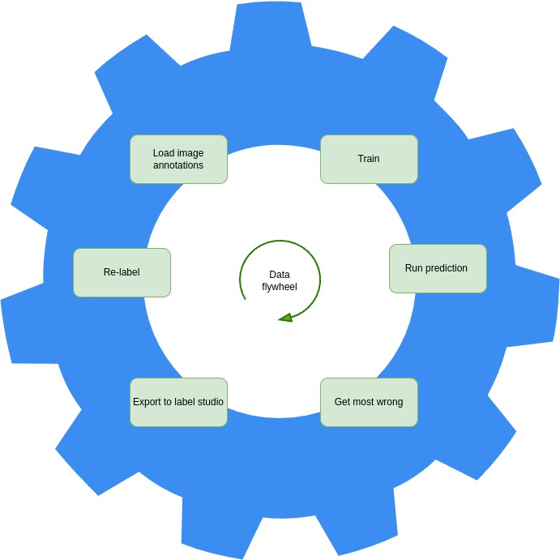

# data-flywheel
Data flywheel to iteratively correct object detection annotations



Install

```
git clone https://github.com/dnth/data-flywheel
cd data-flywheel
```

```
./setup_runpod.sh
```

In a new terminal, activate the data_flywheel conda environment

```
conda activate data_flywheel
```

and run the pipeline

```
python run_pipeline.py
```